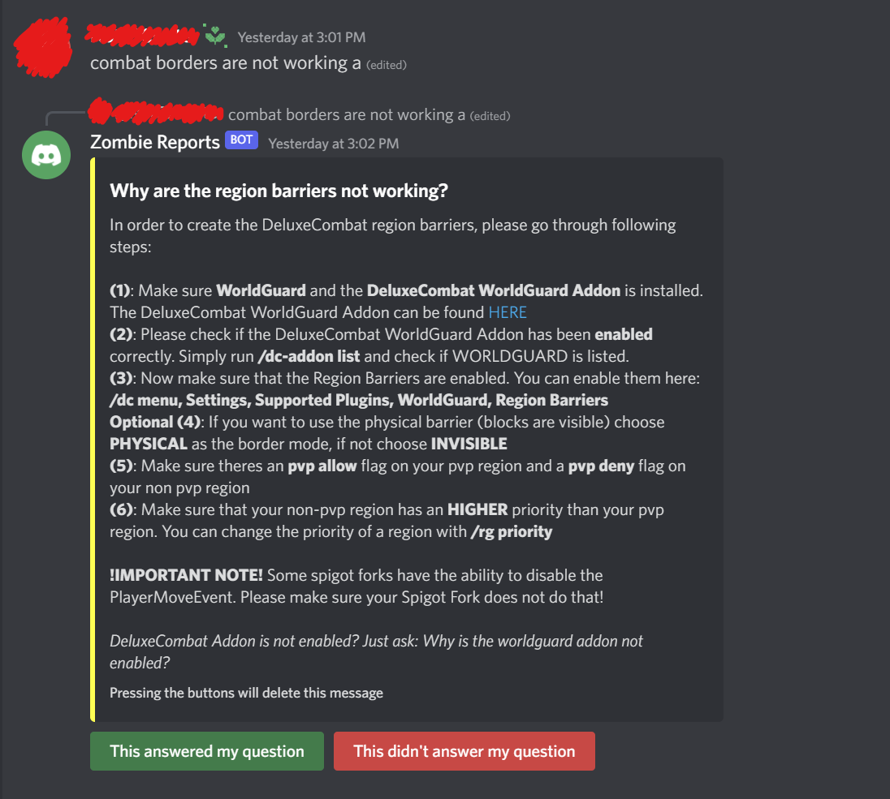

<div align="center">

# Auto Support

[](https://github.com/CJCrafter/AutoSupport/releases/latest)
[](https://github.com/CJCrafter/AutoSupport/releases/latest)
[](https://github.com/CJCrafter/AutoSupport/wiki)
[](https://github.com/CJCrafter/AutoSupport/blob/master/LICENSE)

A poor man's solution to answering those pesky commonly asked questions automatically.
</div>


### Information
In the world of Tech Support, we often find ourselves answering the same questions
over and over again. Programmers don't like repetition of course, so here is my solution:
1. Detect if a message is a question
2. Scrub the question for keywords
3. Match those keywords up to a common question
4. Reply automatically with good information

<details>
    <summary>Auto Support in the Field</summary>




</details>

### Platforms
As of the time of writing, there is only direct support for 
[Discord](https://github.com/CJCrafter/AutoSupport/blob/main/src/main/java/me/cjcrafter/autosupport/discord/DiscordImpl.java)
and [Console](https://github.com/CJCrafter/AutoSupport/blob/main/src/main/java/me/cjcrafter/autosupport/console/ConsoleImpl.java)
applications, but with a bit of tweaking you could implement this for whatever you need. 

### How to (Dependency)
If you are not using gradle, then you'll have to add the dependency manually. If you
are using gradle, you're going to need a [GitHub Token](https://docs.github.com/en/authentication/keeping-your-account-and-data-secure/creating-a-personal-access-token).
It will need permission to `read:packages` (No other permissions are needed!):

- [ ] write:packages 
  - [x] read:packages 

Create a `gradle.properties` file under your root project directory.
```properties
user=<Github Username>
pass=<Generated Token>
```

Add the following to your `build.gradle.kts` file. 
```kotlin
repositories {
    maven {
        name = "GitHubPackages"
        url = uri("https://maven.pkg.github.com/CJCrafter/AutoSupport")
        credentials {
            username = findProperty("user").toString()
            password = findProperty("pass").toString()
        }
    }
}

dependencies {
    implementation("me.cjcrafter:autosupport:1.0.1")
}
```

### How to (Use)
Check out my [YouTube video]() for a more in-depth explanation. 

```json
{
  "Question": "How to tie a tie?",
  "Activator": "<QUESTION,ALWAYS>",
  "Only_Unverified": false,
  "Channel_Whitelist": true,
  "Channels": [
    "YOUR CHANNEL ID"
  ],
  "Delete_After_Answer": false,
  "Keys": [
    "key,key2,key3:-1",
    "craft:1",
    "recipe:1"
  ],
  "Key_Threshold": 1,
  "Message": [
    "In order to add crafting recipes to your weapons, please check out our [tutorial](https://www.youtube.com/watch?v=OUhRLyh1mAg)",
    "\n",
    "\nOr check out [the wiki](https://github.com/WeaponMechanics/MechanicsMain/wiki/General#recipe)"
  ],
  "Media": "imgur.link/whatever-i-am-not-googling-an-actual-image",
  "Button": {
    "Text": "Crafting Tutorial",
    "Link": "https://github.com/WeaponMechanics/MechanicsMain/wiki/General#recipe"
  }
}
```

#### Question
This is what the bot *thinks* the user said. For example, if you're creating an auto-support for
how to add crafting recipes, you should use something like `"How do add crafting recipes to items?"`.

#### Activator
* `Question`: Only respond to messages that are questions.
* `Always`: Always try to respond to a message. 
* You can [add more options](https://github.com/CJCrafter/AutoSupport/blob/main/src/main/java/me/cjcrafter/autosupport/SupportData.java#L24) by contributing.

#### Only_Unverified
true -> message is only sent to users without the verification role
false -> message is sent to anyone

#### Channel_Whitelist
true -> only check channels in the `Channels` list
false -> only check channels **NOT** in the `Channels` list

#### Channels
The `long` id of the channel(s). Right-click on your channel in discord and press `Copy ID`.
For example: `"1014360547971584131"`

YES. IT IS A STRING. NOT A NUMBER.

#### Delete_After_Answer
true -> If the user pressed :check:, then their question will be deleted (since it was answered) in 30 minutes.
false -> The question/answer stay in the channel no matter what.

Use `true` if you are picky about message spam in your channel. Use `false` to avoid any confusions.
The user can delete the message no matter what by pressing :x:

#### Keys
Ok, this is the important stuff. When a message is searched, it calls `question.contains(key)`
for each key. If that returns `true`, then the `value` will be added to the total.
If `total >= threshold`, then the bot answers with this answer.

Format is: `key1,key2,maybe even a full sentence:value`

Any key stored in the SAME LINE as other keys won't get checked multiple times... So for example

```json
  "Keys": [
    "explosion:2",
    "block:1",
    "come back,reappear,regen:1"
  ]
```
Here are the `total`s for each message:
`How do I create an EXPLOSION?` -> 2
`How can I break blocks?` -> 1
`After the blocks break, can I make them come back?` -> 2
`Can they come back? You know... like regenerate?` -> 1

#### Key_Threshold
^ Used with `Keys`. How big does `total` need to be before this message is sent?

#### Message
The actual response. Since this is an embed, it supports markdown formatting, like
* [links](google.com)
* **bold**

NO, WE DON'T ADD NEW LINES AUTOMATICALLY. DO IT YOURSELF.
NO, DISCORD EMBEDS DON'T SUPPORT IMAGES. SEE THE `Media` OPTION

In order to use channels, use `<#channel_id>` (users would be `<@user_id>`)... This is
discord formatting stuff.

#### Media
Includes the image at the given URL at the bottom of the embed. Cannot be a video, only a thumbnail.

#### Button
Just a custom button that users can push... Usually to your wiki, but it would be hilarious
if you sent them to a rick roll video. 